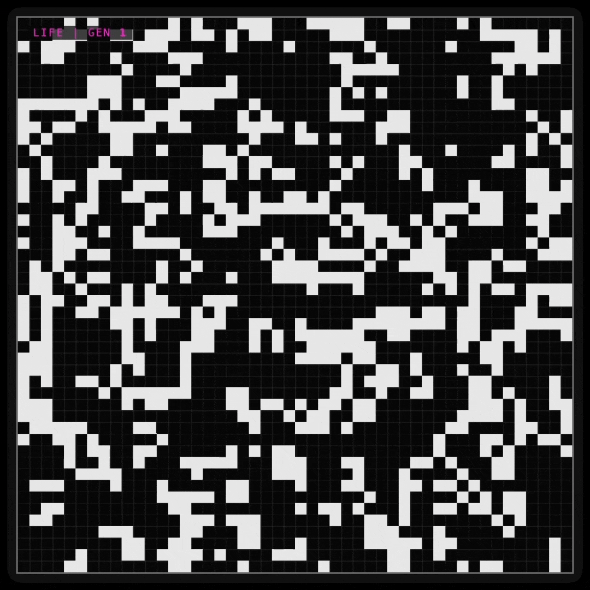
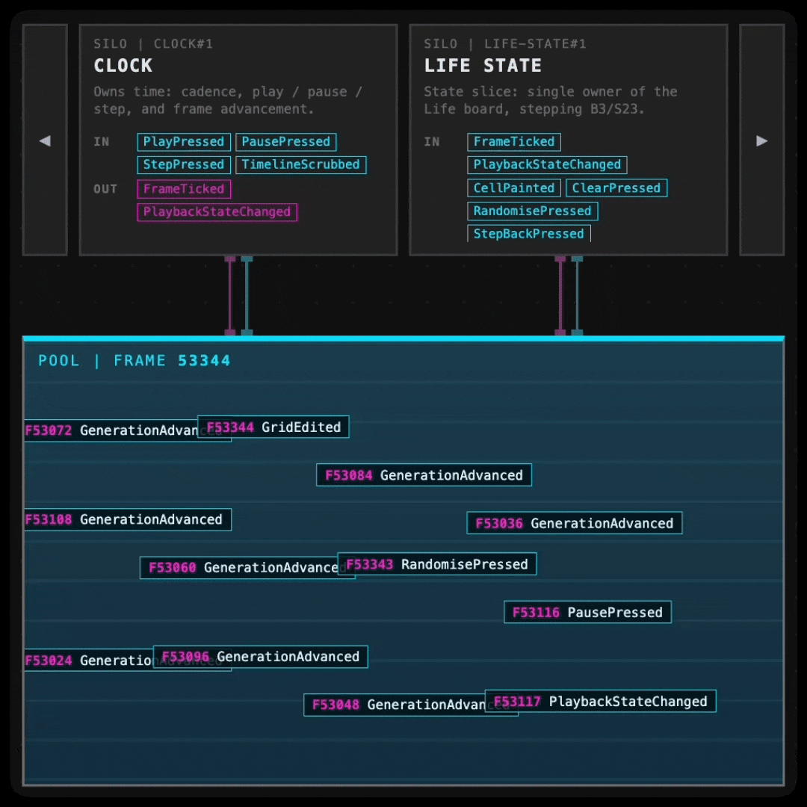
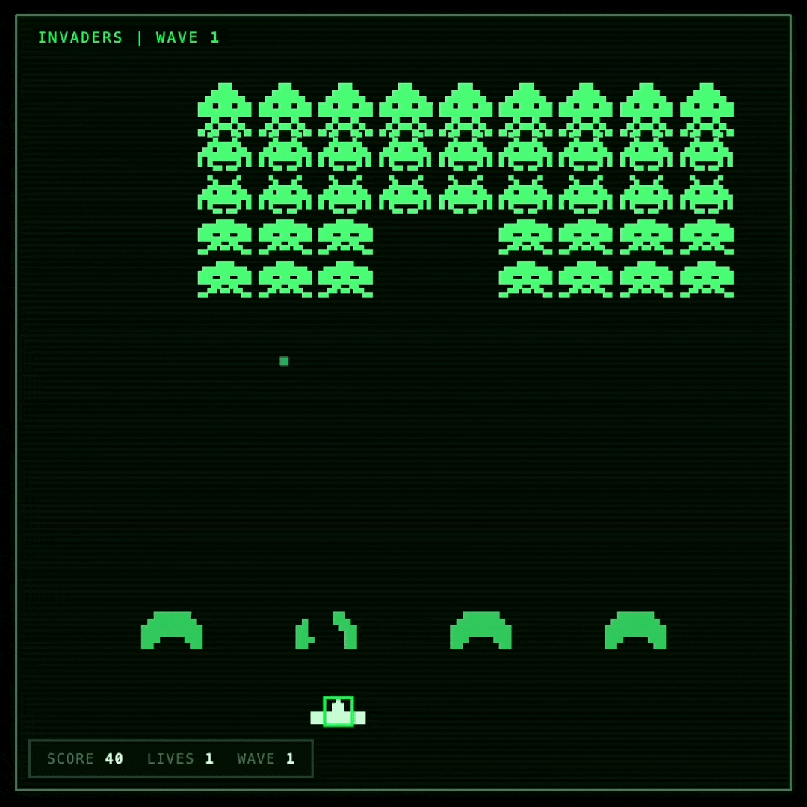
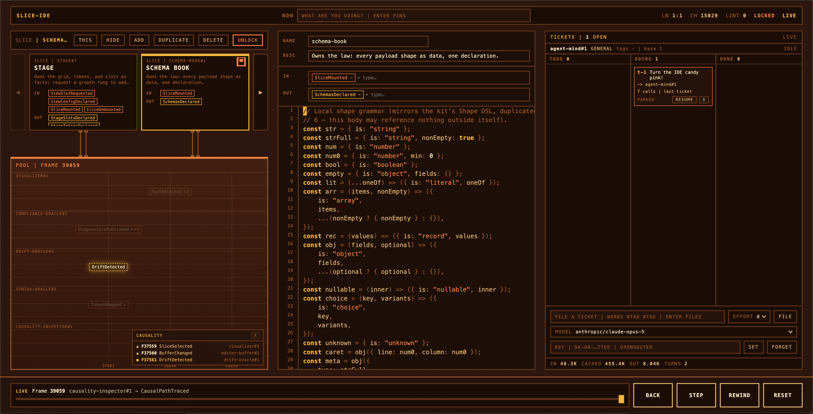
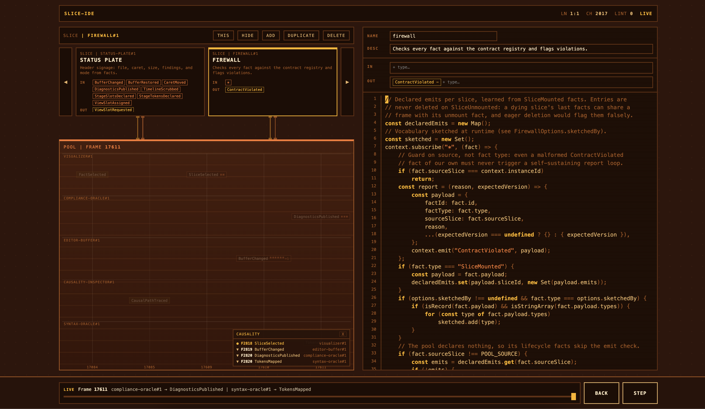

# Summary

> [!WARNING]
>
> Experiment 👨‍🔬
>
> This write-up is an active work in progress. This is the public write-up for a private repository, so some of the content is intentionally vague or incomplete. If you have questions, please reach out to me directly.

It is the age of the LLM, and the thing I struggle with most, also happens to be something LLMs struggle with too -> `context management`.

| Conways Game of Life (Slice)                                            | Slice Visualizer (Also a Slice)                              |
| ----------------------------------------------------------------------- | ------------------------------------------------------------ |
|  |  |
|                             |           |

My biggest gripe in software is how "best practice" is to split everything up into different files, different classes, across different folders and projects. I understand _why_ we do this.

But for someone who struggles with context switching, it is difficult to hold in memory a single feature across a massive file system abstraction.

This experiment asks this question:

> "What if each feature in a project was an enitrely self-contained _slice_, such that a human or agent can glance at the _slice_ in isolation, without additional context, and understand its function?"

The architecture that falls out of this, and the conventional wisdoms it attacks:

- Hard enforced boundaries:
  - A _slice_ can never reference another slice, only a contract.
  - A _slice_ is a single file implementing a single _feature_.
  - EVERYTHING is a _slice_.
    - Need a clock / timer? _slice_
    - Need a debugger? _slice_
    - Need rendering? _slice_
    - Need state? Yes, a _slice_
- Duplicate code:
  - Copy pasting code between _slices_ is explicitly desired (more on this in tooling) and managed via tooling, where copied code is _cloned_ and kept in sync via tooling.
  - A feature has to be entirely self-describing, including all inline code to make it work.
- Communication:
  - All communication happens to a global shared _pool_ which buffers events
  - _Slices_ dictate which events they emit, and which events they consume
  - _Facts_ are events that have happened. Facts emitted in frame N are visible in frame N+1.
- Primitives:
  - The _Pool_, _Slices_, _Facts_
  - The _Pool_ is effectively the kernel responsible for broadcasting and receiving events to / from slices.
  - The _Slices_ are self contained features that emit or consume _Facts_
  - _Facts_ are events that have happened, which contain a causality tag and a payload. So you can ask "why did X happen" and walk the fact tree.

# Slice IDE - An Experiment in DogFooding

An IDE / editor, built fully on the slices idea, dogfooding the idea - as it were - whilst also being a self-editing editor.

Result - cool, but mostly a pain in the arse to work with. The editor can brick itself. Maybe there is something there, but probably not. BYO API-Key so an LLM can add / remove slices at will (Add game panels, sound panels, remove panels etc)

